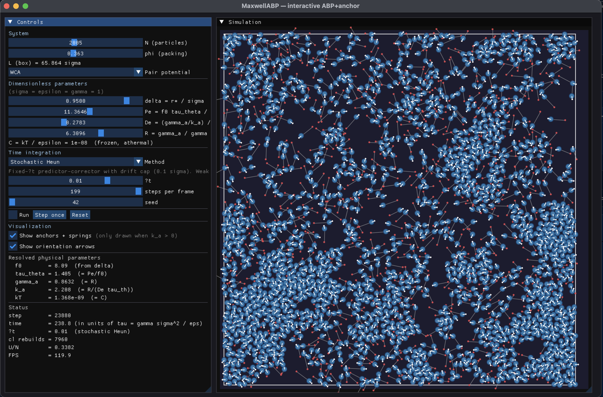

# MaxwellABP

A modular **C++17** engine for **2D active Brownian particles (ABPs)** with
**Maxwell-type viscoelastic anchors**, integrated under overdamped Langevin
(Brownian) dynamics. Each particle is repulsive (WCA or soft-sphere), optionally
self-propelled, and tethered to an anchor by a spring-in-series-with-a-dashpot — a
*Maxwell* viscoelastic element, which is where the name comes from.

Based on code originally developed by Lara Koehler & John D. (Jack) Treado, located in [this repository](https://github.com/lara-koehler/ViscoElasticActiveBrownianParticles).

Code related to simulations described in Ivan Di Terlizzi*, Lara Koehler*, and John D. Treado*, [arXiv:2605.29162](https://arxiv.org/abs/2605.29162) (2026).

---

## Features

- WCA / harmonic soft-sphere repulsion with periodic minimum-image.
- Active Brownian self-propulsion (`f0` from a steady-state overlap `delta`; persistence via `Pe`).
- Maxwell viscoelastic anchors (spring `k_a` + dashpot `gamma_a`, memory set by Deborah Number (`De`) and friction ratio `R`).
- Two integrators: Euler–Maruyama and stochastic Heun (weak order 2).
- Sort-based cell / Verlet neighbor lists (GPU-shaped, with small-box brute-force fallback).
- On-the-fly velocity/force/orientation correlations and contact-duration statistics.
- Self-describing HDF5 trajectories + a Python loader and analysis pipeline.
- Optional ImGui + GLFW interactive viewer.

---

## Quick start

```bash
# Dependencies (macOS)
brew install hdf5 cmake

# Build the CLI + tests
cmake -S . -B build -DCMAKE_BUILD_TYPE=Release
cmake --build build -j

# Run one simulation, auto-organized under local/output/
./run.py --tag hello --t_end 0.1 --N 128 --phi 0.5
```

This writes `local/output/maxabp_run_hello/` containing the trajectory
(`maxabp_run_hello_seed0.h5`), the exact input config, the captured stdout, and a
`log.json` of run metadata.

Run the binary directly for full control:

```bash
./build/sim info examples/input.json          # show resolved + derived parameters
./build/sim run  examples/input.json --N 500 --phi 0.7 --integrator heun
```


---

## Repository layout

```
MaxwellABP/
├── CMakeLists.txt           # build (sim + tests; GUI optional via -DBUILD_GUI=ON)
├── main.cpp                 # CLI: run / info / help
├── include/ , src/          # engine: System, Box, ForceCalculator, CellList,
│                            #   integrators, Config, TrajectoryWriter, accumulators
├── test/                    # GoogleTest suite (~129 tests)
├── gui/                     # ImGui + GLFW viewer (optional)
├── examples/input.json      # default base config
├── run.py                   # single local run  -> local/output/
├── psweep.py                # parameter sweeps   -> SLURM jobs
├── python/                  # bdtrajectory loader + analysis pipeline
├── tests/                   # pytest suite for the Python pipeline
```

---

## Testing

```bash
ctest --test-dir build --output-on-failure
```

See [Building & Testing](wiki/Building.md) for details and per-suite filters.

---

## GUI

In order to compile the GUI simulator:
```bash
cmake -S . -B build-gui -DBUILD_GUI=ON -DCMAKE_BUILD_TYPE=Release
cmake --build build-gui --target sim_gui -j
```
To run, use
```bash
./build-gui/gui/sim_gui  
```

GUI built using [Dear ImGui](https://github.com/ocornut/imgui).